# The Binomial Method for Option Pricing

- Written by: Joshua O'Riordan

## Table of Contents

1. [About the Project](#about)
2. [Project Structure](#structure)
3. [Building and Running](#build--run)
    1. [Requirements](#requirements)
    2. [Building](#building)
4. [User Manual](#user-manual)
    1. [Basic Controls](#basic-controls)
    2. [Modelling](#modelling-options)
        1. [Options](#options-parameter-entry)
        2. [Models](#model-parameter-entry)
        3. [Pricing](#pricing-options)
        4. [Visualizing](#visualizing)

## About

This project uses binomial trees to efficiently and flexibly price options. 

Owing to the everchanging nature of financial markets, a discrete-time framework such as that implemented by the Binomial Model allows for a more precise insight into the price evolution of equities. Breaking the options’ lifespan into a series of interval, affords a user the ability to experiment with varying market conditions.

In addition to the terminal based user interface, the program integrates Matplotlib, a powerful data visualization library from Python to cleanly and intuitively present information to users.

To extract the true potential of binomial models, users can fetch live market data from public APIs to fit models to the real world. This project supports fetching data from FRED and Polygon.io to provide up-to-date asset prices, asset volatilities and risk-free interest rates.

## Structure

- ```src/``` - the source files for the project.
- ```include/``` - the header files for respective source files.
- ```options/``` - JSON files for serialized options.
- ```models/``` - JSON files for serialized models.
- ```resources/``` - static resources used by the program.
- ```auth/``` - txt files with API keys.
- ```installers/``` - bash scripts containing install instructions for dependencies.

The top-level directory contains some important files; this README, a makefile and a CMake build file.

## Build & Run

### Requirements

Your system must have the following installed:
- make
- CMake
- gcc (or another C++ compiler)
- Python3
- matplotlib
- cpr
- nlohmann-json

The required components can be installed using install-requirements.sh, which will work for Mac and Linux.

Optionally, the program can benefit from the installation of:
- OpenBLAS
- cuBLAS (Linux only)

These optional components can be installed with install-openblas.sh and install-cublas.sh.

### Building

You can get started with this program by using the ```make``` command in the terminal, which will compile and run the project code.

The makefile has some other options too:
- ```make build``` will build the project and display any compilation errors.
- ```make run``` will run the program (if it has already been compiled).

You don't need to touch the CMake file or call ```cmake``` at all to run this project.

## User Manual

### Basic Controls

User interaction takes place on a terminal based interface. This interface is keyboard controlled. Arrow keys are used to navigate and move between interfaces, the enter key is used to interact with elements within an interface.

Every interface will display its controls and their effects at the top of the page.

Up & down arrows (↑/↓) are used in every interface to move between elements and content.

The enter key (↵) is used to select/deselect an element of an interface (applies to Menus, Inputs & Tables).

Left and right arrows (←/→) are used to 'finalize', which means you press them when you are 'done' with a certain interface. The usage of these arrows varies so check at the top of your interface which is effective.


### Modelling Options

You can start modelling by selecting the 'Option Pricing' entry in the main menu.

#### Options Parameter Entry

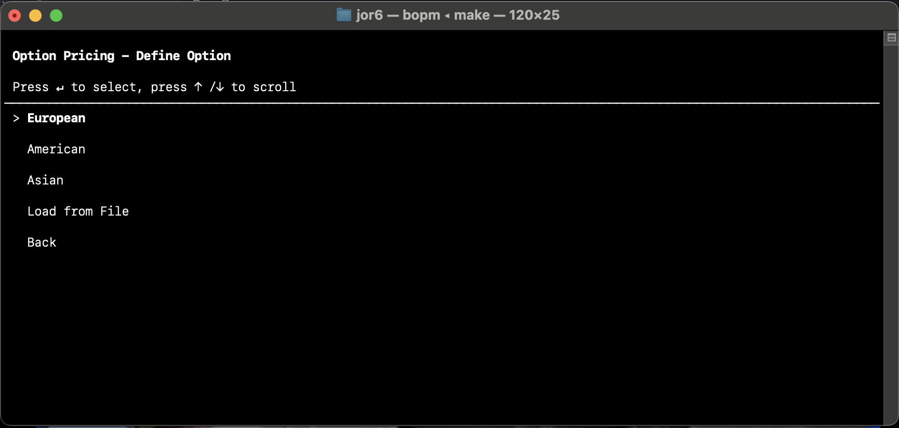

When modelling options, you have the choice to instantiate different types of options (European, American & Asian), or load one from a saved file.

Ensure that you are familiar with options 'styles' before you start modelling. Here is a shorthand guide:

- European: exercised at expiration.
- American: can be exercised at any time before expiration.
- Asian: exercised at expiration, payout based on average price.

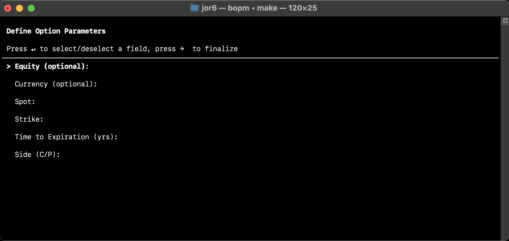

To define an option, you must specify some key parameters:

- Asset (optional): if you write in the ticker of an asset and leave the 'Spot' field blank, the program will automatically fetch the latest traded price of the asset from an API.

- Currency (optional): the default value is USD as the majority of option trading is settled using dollars, however if you specify EUR for example, the program will convert prices and calculations to that currency.

- Spot: the current price of the asset, if you are not using the API fetching method.

- Strike: the strike price of the option. If you are price fetching using the API, you can leave this blank temporarily.

- Expiration: the duration of the option, denominated in years.

- Side: call or put

An additional parameter needs to be specified for Asian style options:

- Payoff Type: fixed or floating, determines how the payout of an Asian option is calculated.

You can modify the parameters of an option after entry. Select Define Option, then the same option type, and it will be loaded into the interface.

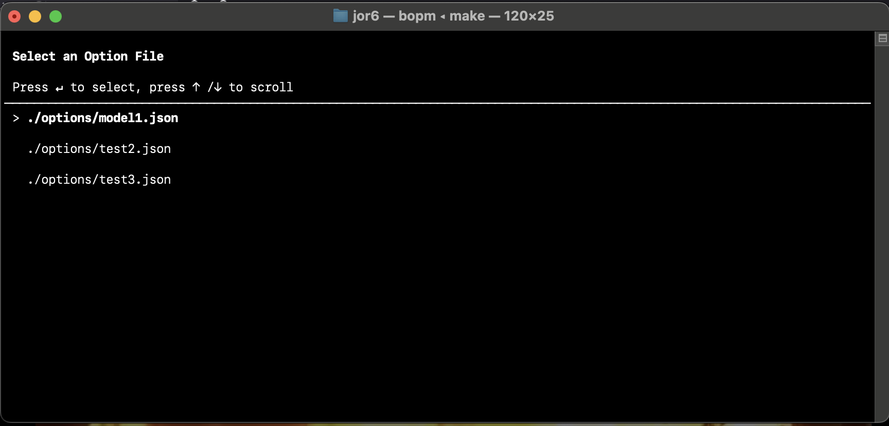

Finally, if you've already been modelling options and saved some to your local disk, you can opt to 'Load from File'. This will read in an instance of an option that has been written to a json file.

#### Model Parameter Entry

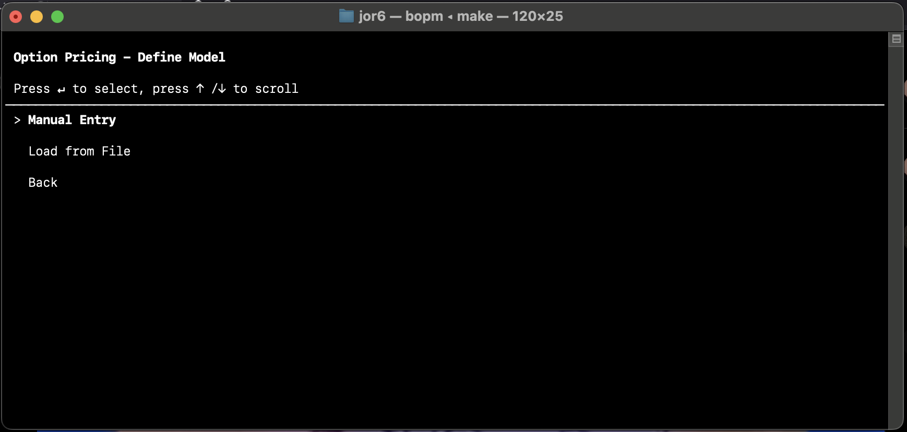

As with options, you will have the ability to manually specify the parameters of your binomial model, or load one from a file.

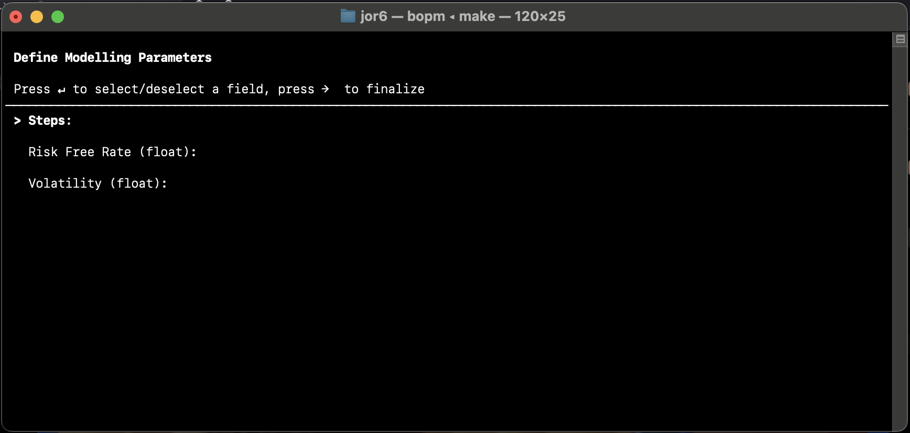

To define a binomial model, you must specify the following parameters:

- Steps: number of intervals in the model.

- Risk Free Rate: expected interest rate.

- Volatility: volatility of the underlying asset.

When inputting values for RFR and Volatility, you can specify the value overall, or at each time step. The program will interpret a single float (e.g. "0.5") as being a constant value for the options' lifetime. Comma seperated values (e.g. "0.1, 0.2, 0.3") will be interpreted as specifiying a value for individual time steps. If you enter comma seperated values, ensure that you enter EXACTLY one value for each time step.

The RFR and volatility fields can be left blank to fetch values from an API. However, you will have to modify these fields again to be able to use variable values.

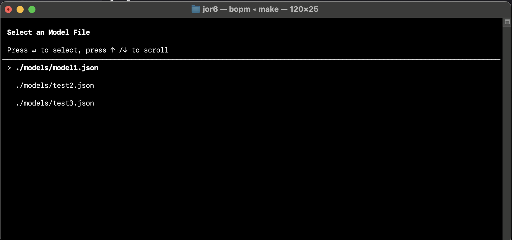

Again, if you've already been modelling options and saved some to your local disk, you can opt to 'Load from File'. This will read in an instance of a model that has been written to a json file.

#### Pricing Options

Once you have loaded an option and a model, the parameters will be displayed in the main Option Pricing interface as such:

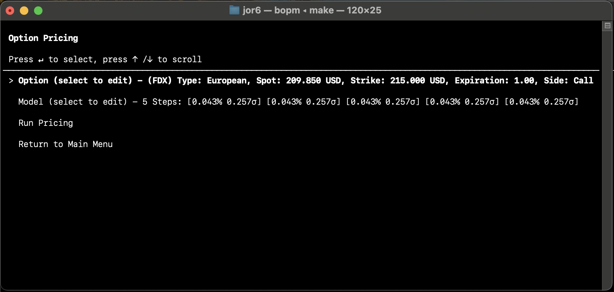

If you are satisfied with these, you can select the 'Run Pricing' option from the menu. You will then see the following interface:

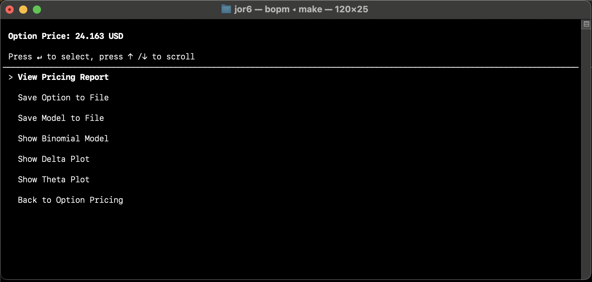

The pricing report displays all parameters of a model in one interface; option price, option characteristics, model parameters, delta & theta.

The arrays for RFR and Vol. can be read from left to right, where the value at the start represents the value at step 1.

The trees for the greeks are also read left to right. There are twice as many values in every consecutive column, these represent the value of a greek after an upward or downward movement in the asset price.

You should already be familiar with greek symbols, but here is a shorthand guide:
- Delta: measures sensitivity of option price to changes in the underlying price.
- Theta: measures decay of option value as time passes.
- Vega: measures sensitivity to volatility in the underlying.

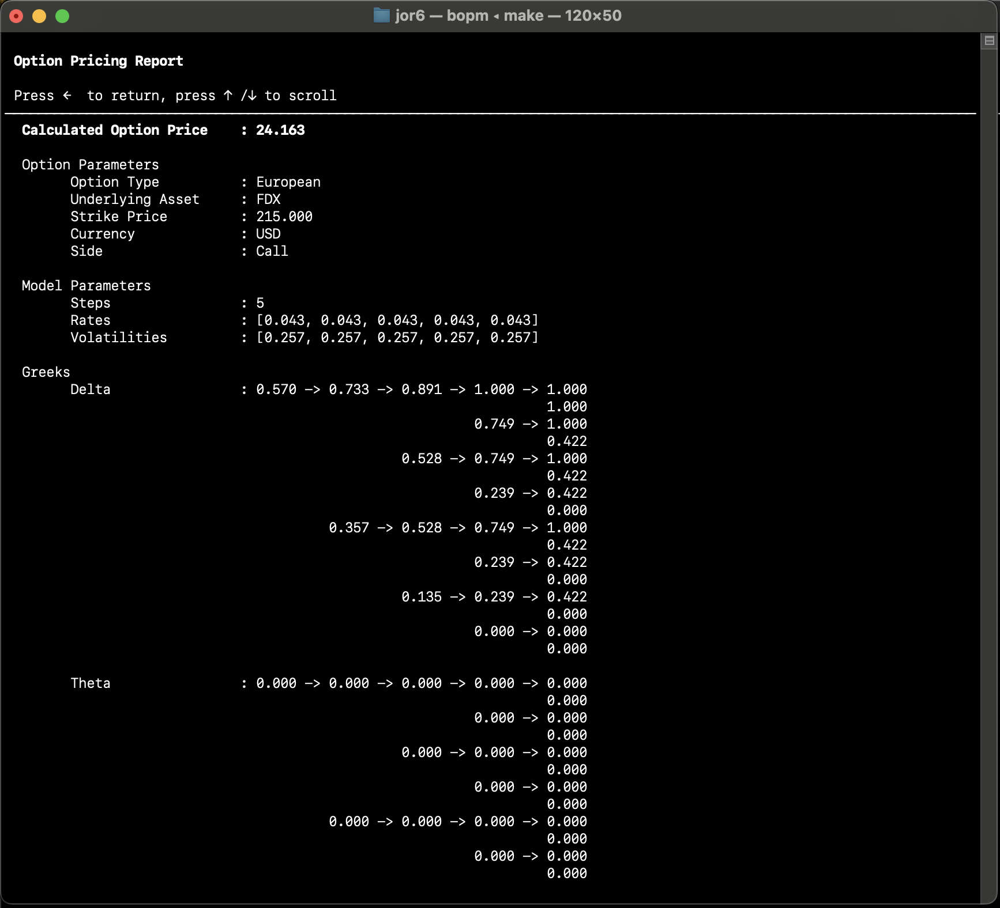

From this interface, you can also save your option or model to a json file. All you need to do is enter a file name:

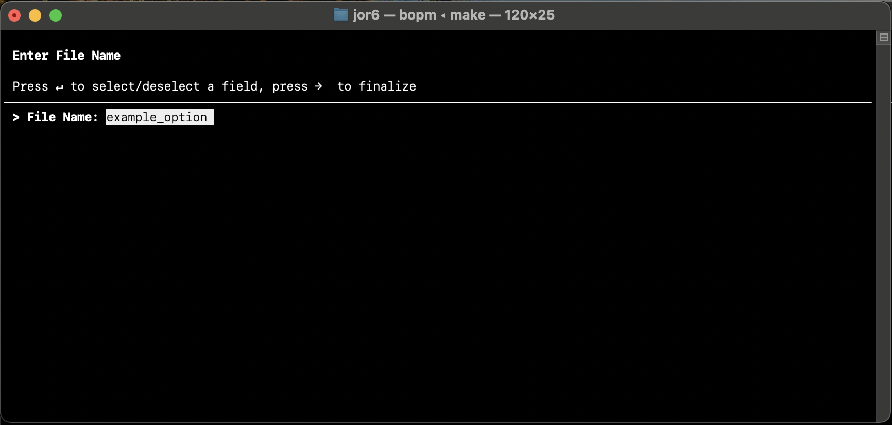

#### Visualizing 

The program enables a user to create different plots to visualize their binomial model. These are all accessible through the 'Show ... Plot' options. Here are previews of the available plots:

- Binomial Model: shows the potential paths of price movement, relative to starting price and strike price.

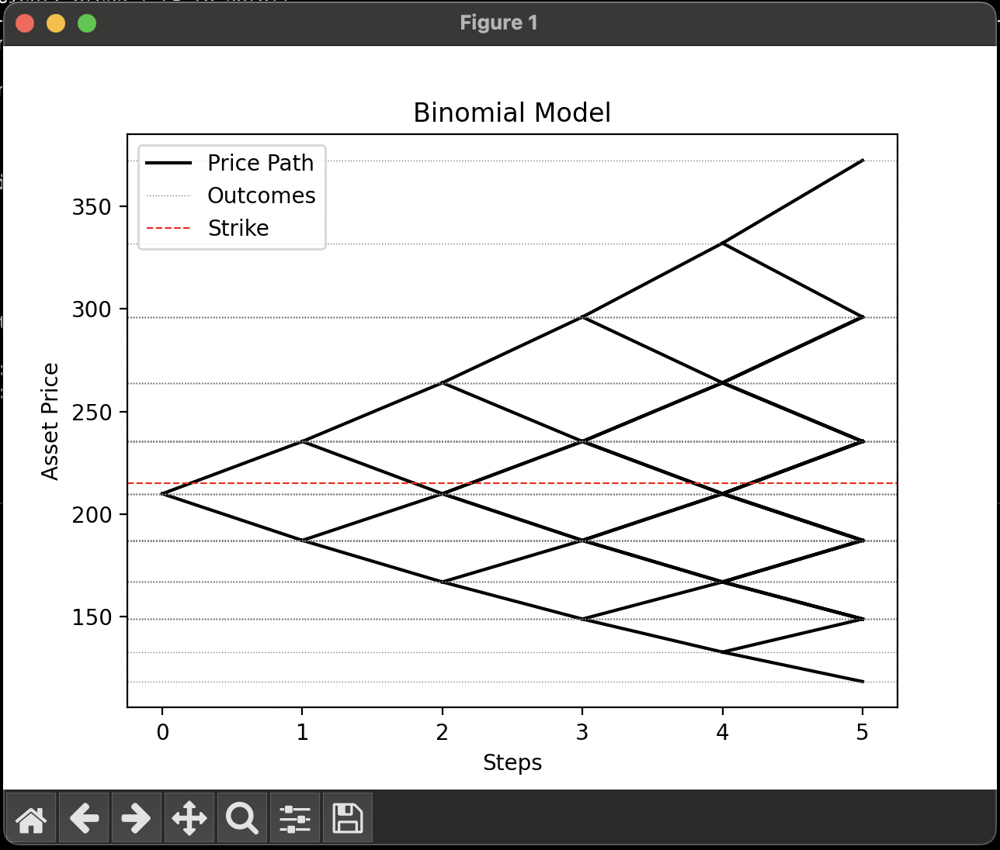

- Greeks: plots of delta & theta will produce an image that show a value for each node in the model. These node are also colored using a heatmap to provide an intuitive representation.

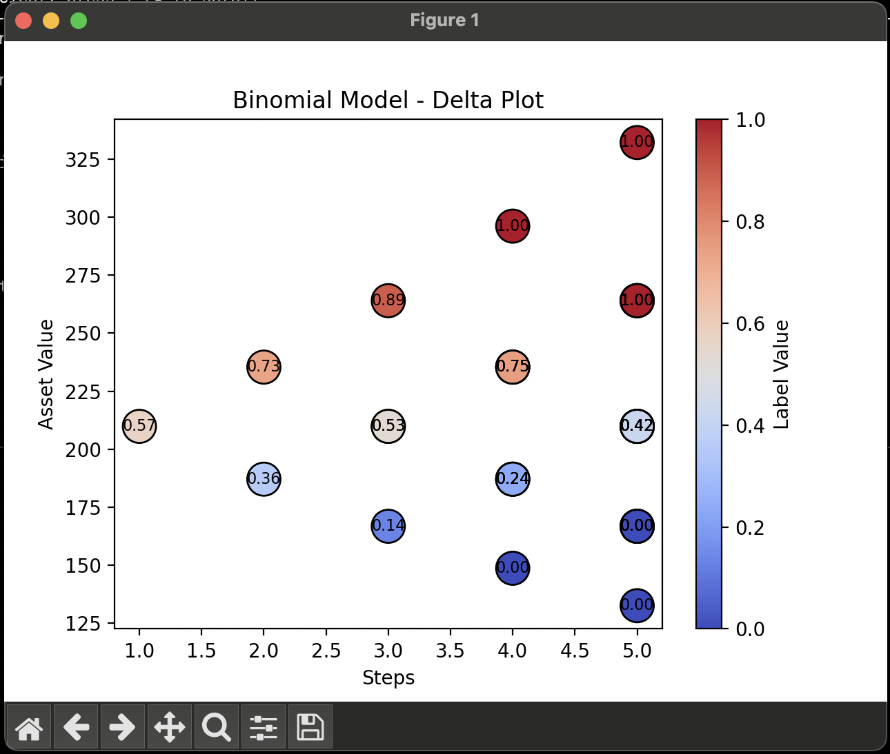

Matplotlib graphics can be saved to your disk using the 'Save' button in the window.
